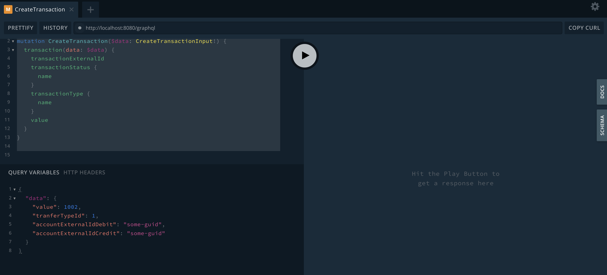
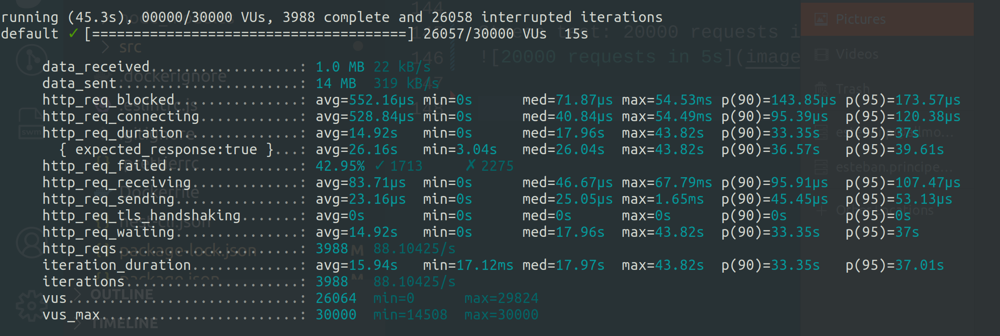
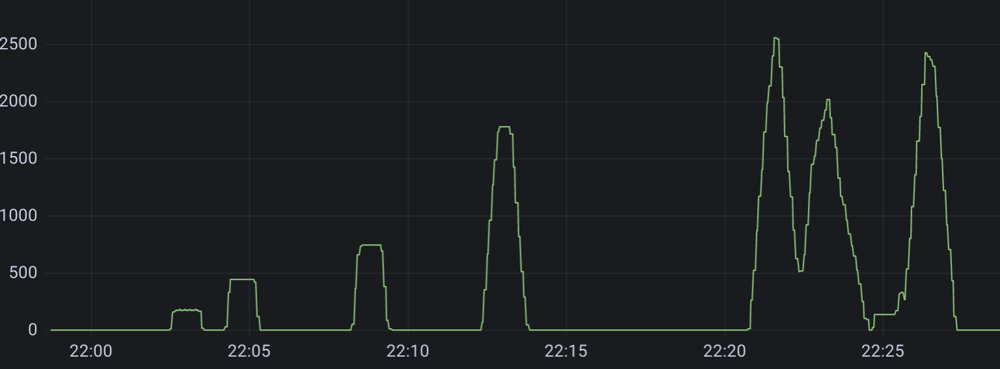

# Yape Code Challenge: Done :frog:

Following all the requirements given by Yape, this project was developed with

<ul>
<li>Docker Componse</li>
<li>Nest.js</li>
<li>Apache Kafka</li>
<li>TypeOrm: Migrations, Entities</li>
<li>GraphQL</li>
<li>Prometheus</li>
<li>Grafana</li>
<li>Stress Test made with K6</li>
</ul>

The main idea of this architecture is to implement a microservice that takes care of the transaction validation async so the main server can continue processing new incoming transactions.

## Kafka

Kafka will ensure that all data will be delivered to the server and antifraud service, so they just need to wait to Kafa to come with a request.

## GraphQL

Graphql wil reduce the number of database requests by grouping requests coming from clients and sharing between those requests the response of only one db query, Otherwise we must do a db query for eaach request.


## Running the project
Instead of running the project, you can see me testing the project [here](https://www.youtube.com/watch?v=JOMq55FhS-M)
### Create and build all services

Go to the repo root and run
`docker-compose up`

Now all containers will be created and each of them will install all the dependendencies.

This project already has migrations added, so the entities are going to be created and then initialized with seed data coming from the first migration.

### Test

We first must have all the services running.

There are multitple ways to test the project, since we have GraphQL added to the project.

##### First way

###### Step one

Enter [http://localhost:8080](http://localhost:8080) or [http://localhost:8080/graphql](http://localhost:8080/graphql)

###### Step two

```graphql
mutation CreateTransaction($data: CreateTransactionInput!) {
  transaction(data: $data) {
    transactionExternalId
    transactionStatus {
      name
    }
    transactionType {
      name
    }
    value
  }
}
```

With the query variables:

```json
{
  "data": {
    "value": 111111545,
    "tranferTypeId": 1,
    "accountExternalIdDebit": "some-guid",
    "accountExternalIdCredit": "some-guid"
  }
}
```

It should be something like this


##### Second way

Use the curl to create one transaction.

Go to the curls directory and execute.

```bash
  chmod +x create-transaction-curl.sh
```

Then execute the curl!

```bash
  ./create-transaction-curl.sh
```

It should display something like this

```bash
./create-transaction-curl.sh
{"data":{"transaction":{"transactionExternalId":"cfbdae29-bc01-4239-a1ec-6e22c3c68855","transactionStatus":{"name":"pending"},"transactionType":{"name":"type-1"},"value":1002}}}
```

You can also do a get all transactions. Here we'll see how important is GraphQL to increase the performance, because it will reduce the number of db requests.

Here it is the mutation that is going to be used

```graphql
query GetTransactions {
  transactions {
    transactionExternalId
    value
    transactionStatus {
      name
    }
    transactionType {
      name
    }
    createdAt
  }
}
```

or you can use the curl that it is in the curls dir (remember to do chmod +x <bash-file> before).

### Additional features

#### Grafana && Prometheus
This two components will take care of capturing data in realtime and displaying in dashboards

#### K6 stress testing

Made a stress test with K6 to the project.
Stress test: 1000 requests in 5ms


Stress test: 5000 requests in 15ms


Stress test: 10000 requests in 10ms


Stress test: 20000 requests in 10ms


Stress test: 30000 requests in 15s



And we can se how Grafana with Prometheus were showing the rate transactions created in real-time

Transactions created during stress tests in real-time



If you want to see the dashboards in real time, go to [http://localhost:3000](http://localhost:3000) and enter with username ```admin``` and password ```admin```. 
Then go to Dashboards and then enter the Transactions Server folder. At the beginning it should be all empty, so start using the create transaction mutations or the curl to see changes. 